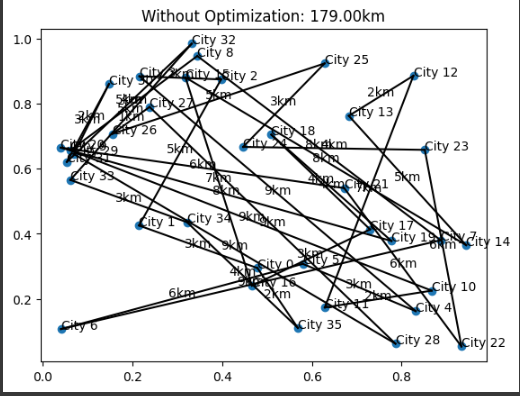
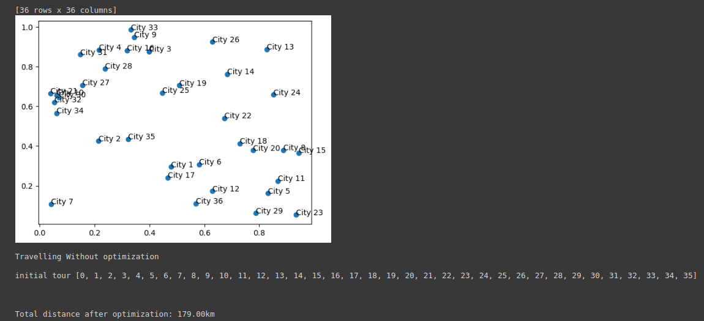
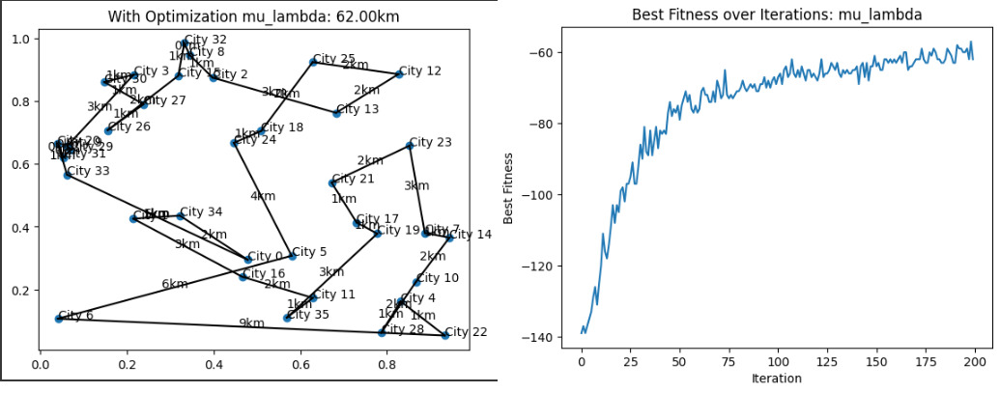
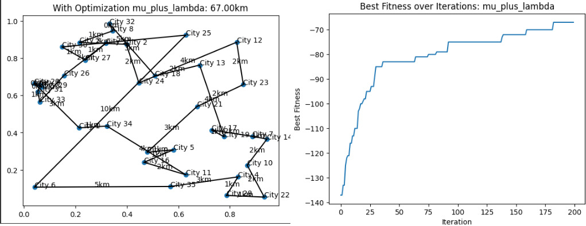
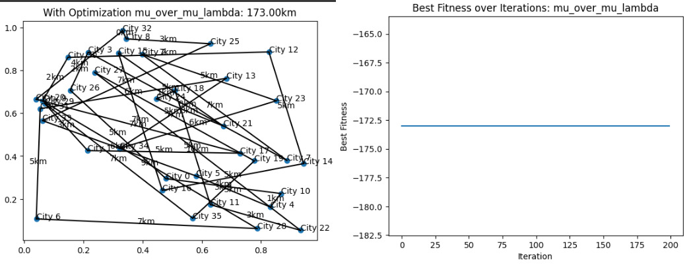

# Traveling Salesman Problem Optimization

This project demonstrates the use of Evolution Strategies (ES) to optimize the Traveling Salesman Problem (TSP). The TSP is a classic optimization problem where the goal is to find the shortest possible route that visits a set of cities and returns to the origin city.

## Project Overview

## Project Overview

1. **Generate a set of random cities with coordinate values.**
2. **Calculate the distances between all pairs of cities.**
3. **Use an Evolutionary Algorithm to optimize the route:**
   - Define a population of candidate solutions (city visit orders).
   - Generate offspring solutions by applying mutation to the parent solutions.
   - Evaluate the fitness of each solution (total distance of the route).
   - Select the best solutions to be parents for the next generation.
4. **Plot the final optimized route on a map of the cities.**

### Optimization Parameters and Strategies

Several constants are defined for the optimization process:

- **DIMENSION**: The number of cities.
- **POPULATION_SIZE_MU**: The number of parents in the population.
- **OFFSPRING_SIZE_LAMBDA**: The number of offspring to generate.
- **SIGMA**: The standard deviation of the Gaussian noise added to generate offspring.
- **MAX_GENERATIONS**: The maximum number of generations to run the optimization.

Different strategies for the ES optimization are available, such as:

- **Mu Lambda**
- **Mu Plus Lambda**
- **One Plus One**
- **One Plus One 1 Fifth**
- **Mu Over Mu Lambda**

## Dependencies

- **numpy**
- **pandas**
- **scipy**
- **matplotlib**

## Visualizations

### Initial Route

### Scatter Plot of Cities

### Optimization Strategies

#### Mu Lambda

#### Mu Plus Lambda

#### Mu Over Mu Lambda

## Comparison of Strategies

| Strategy                      | Total Distance |
|-------------------------------|----------------|
| Without Optimization          | 179 km         |
| (μ, λ) Mu Lambda ES           | 62 km          |
| (μ + λ) Mu Plus Lambda ES     | 67 km          |
| (μ/μ, λ) Mu Over Mu Lambda ES | 173 km         |

From the above table, we can see that with our parameters, the (μ, λ) Mu Lambda ES gives the best result. Although in (μ + λ) Mu Plus Lambda ES we retain good solutions from parents as well, it limits wide exploration. So in the case of the Traveling Salesman problem, (μ, λ) Mu Lambda ES gives the best result.